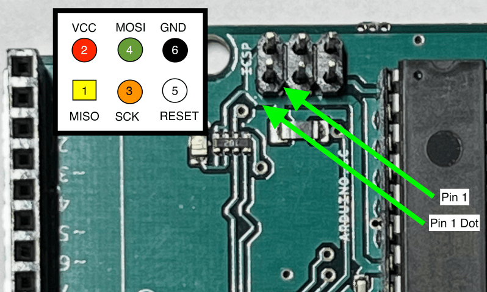

# Programming the *Arduino* *Uno* in *Flashforth*

I originally thought of this framework as similar to the *Arduino* framework, where one had libraries which contain specialized code for specific operations. While a Hardware Abstraction Layer (HAL) makes sense, creating Libraries in the vein of the *Arduino* framework, does not. It isn't "Forth-like", in that Libraries aren't the way *Forth* was designed to work. Or most importantly, as this continues to be a site to help someone program in *Forth*, the *Arduino* approach isn't appropriate to developing code in *Forth*.

A key value of *Forth*, is that it enables the programmer to deeply understand the processor on which they are working. At times, this can be a detriment, as it takes much more time to translate a datasheet into working code as compared to downloading a library, however, this approach helps you learn how the processor works. This knowledge can be valuable as you continue to work with the processor. The file *m328Pdef.inc* is included in this repository to document ATmega328P constants, the file *Library/328P_HAL.fs* is the *Forth* version of this, except it will base many of the constants per the UNO as mentioned above.

The ATmega328P datasheet is the ultimate arbiter of register names and usage.

## Boards and Microcontrollers
This code is being developed for the *Arduino* *Uno*. Also works on the *Arduino Nano* and the *Microchip 328PB Xplained Mini*.

## Automating serial transfers

**[macOS only]** In developing code, it helps to automate the mundane tasks, in particular, uploading files to the microcontroller board. As I have several development environments which require such automation, I created a repository specific to the task, [CT_build](https://github.com/lkoepsel/CT_build). As in *CoolTerm build*, as it automates microcontroller upload tasks for *C*, *MicroPython* and *FlashForth* along with reconnecting *CoolTerm*. *Per Roger Meier's comments, CoolTerm isn't quite a solid Linux citizen, so its best used with macOS.*

**[Linux]** In Linux, I use *tio* as the serial program and for loading source files, I use a utility, *fu.py*. WIth the help of claude, I created a new version of *up.py*, which claude named *fu.py* for *forth upload* This utility is installed using *uv* as in `uv tool install . `. This utility will upload a forth source file, quite quickly. A typical usage is:
```
fu Library/328P_ports.fs
fu examples/blink.fs
tio forth
```

## Compiling FlashForth
I have a complete [entry](https://wellys.com/posts/flashforth_compile/), however, I will touch on it here as well. Its beneficial to compile your own version as it allows you to continue to make things more efficient for you. For example, I do the following:
1. Increase the baud rate to 250K
2. Added most of the I/O registers (see below)
3. Change the prompt, so I know that this is a different version
## Steps to Compile
### 1. Get source
Put the source on your desktop to keep FlashForth repository, clean.
```bash
cd Documents/flashforth
cp -r avr/FF-ATMEGA.X/ ~/Desktop/FF-ATMEGA.X/
cp -r avr/src/ ~/Desktop/FF-ATMEGA.X/src
```
### 2. Use MPLAB X to create project
Follow the following steps in MPLAB IDE:
1. File -> New Project -> Standalone Project (*Microchip Embedded -> Application Project(s)*)
    1. Device: 328P and Tool: Atmel ICE… (*Optional*, see **Note A.**)
    2. Choose *XC8* as your compiler
    3. *Browse* to Desktop and make the Project Folder *FF-ATMEGA.X*
    4. Set Project Name: FF and Set as main project  (Creates FF.X folder which becomes the main folder)
    5. Finish
2. In the Projects column on the left, right-click on Source Files and add Existing Item *../src/ff-xc8.asm* (*you will need to click the file drop down and go up one folder, to select src folder then the file ff-xc8.asm*)
3. Put the following text in *Production -> Set Project Configuration -> Customize -> XC8 Global Options -> Additional Options* then click *Apply* and *OK*
```bash
-DOPERATOR_UART="${OPERATOR_UART}" -nostartfiles
```
### 3. Edit files to your needs
#### *ff-xc8.asm*
**Optional**
Change the following line 5792 (*search for FlashForth*), it can be anything you want to show up on reset.
```C
# original line
        .ascii    "FlashForth 5 "
# new line
        .ascii    "FF 5 250k    "
```
**Confirm the new text length matches the same spacing as the previous text!**

#### *config-xc8.inc*
Change the following line 41, this increases baud rate to 250k
```C
# original line
#define BAUDRATE0 38400
# new line
#define BAUDRATE0 250000
```

#### *registers.inc*
Add the lines to look like this, adding the 3 registers for each of the ports, Port B, Port C and Port D. Also adding the registers for the Timer/Counters.:
```C
m_const PINB,pinb,0
m_const DDRB,ddrb,0
m_const PORTB,portb,0
m_const PINC,pinc,0
m_const DDRC,ddrc,0
m_const PORTC,portc,0
m_const PIND,pind,0
m_const DDRD,ddrd,0
m_const PORTD,portd,0
m_const TCCR0A,tccr0a,0
m_const TCCR0B,tccr0b,0
m_const OCR0A,ocr0a,0
m_const OCR0B,ocr0b,0
m_const TCCR1A,tccr1a,0
m_const TCCR1B,tccr1b,0
m_const OCR1AL,ocr1al,0
m_const OCR1BL,ocr1bl,0
m_const TCCR2A,tccr2a,0
m_const TCCR2B,tccr2b,0
m_const OCR2A,ocr2a,0
m_const OCR2B,ocr2b,0
m_const TIMSK0,timsk0,0
m_const TIMSK1,timsk1,0
m_const TIMSK2,timsk2,0
```
This step is optional, if you don't make these changes, you will need to add references in your *HAL*. This causes line *3506* `rcall DOTBASE` command to fail (*rcall is relative call*), change it to be a `call DOTBASE` and it will compile properly.

**Note A:** Once the project has been created in *MPLAB X*, it can be moved to another machine. That said, if the second system has a different location for the executables (compiler etc), it requires a session with *claude* to get those references fixed. The good news is once, fixed, you may use the `make` command to create new *FlashForth* versions without *MPLAB X*.
### 4.Wiring Details

| Description | SNAP SIL | Uno ICSP |Wire Color
| :--------- | :----------: | :-----: | -------:
| NC         | 1         |          |         |
| VTG        | 2         | 2        | Red     | 
| GND        | 3         | 6        | Black   | 
| MISO       | 4         | 1        | Yellow  | 
| SCK        | 5         | 3        | Orange  | 
| RESET      | 6         | 5        | White   |
| MOSI       | 7         | 4        | Green   | 
| NC         | 8         |          |         |

### Uno Connector


### Nano Connector

**NOTE:** The Nano ICSP pin 1 is diagonally opposite of the Uno pin 1.

### 5. In terminal
```bash
cd ~/Desktop/FF-ATMEGA.X/FF.X
make clean all MP_PROCESSOR_OPTION=ATmega328 OPERATOR_UART=0
cp dist/default/production/FF.X.production.hex ~/Desktop/FF.hex
cd ~/Desktop
# if your using Microchip SNAP and ATmega328P (Uno)
avrdude -p m328p -P usb  -c snap_isp -e -U flash:w:FF.hex :i -U efuse:w:0xfc:m -U hfuse:w:0xdf:m -U lfuse:w:0xff:
```

### 5. Load Hardware Abstraction Layer (HAL)
I always load the file *Library/328P_ports.fs* as my *HAL*. It adds Uno ports, and AVR words required for pretty much anything that I would do on the Uno. **Consider it required for any of the examples.** You can use [CT_build](https://github.com/lkoepsel/CT_build) to load your files, [**CoolTerm**](https://freeware.the-meiers.org/) (my strongly preferred serial program) or a serial program of your choosing.

## /examples folder
* *blink* - classic *Hello, World* example for microcontrollers [more](https://wellys.com/posts/flashforth_blink/)
* *fsm* - finite state machine with extensive documentation
* *tasks* - example used for benchmarking in this [entry](/posts/board-language_speed/)
* *timing* - using the examples in the forth folder, how to create blocking timing loops
## /forth folder
The **forth** folder is a collection of forth files which are part of FlashFort demonstrations written by Mikael N. Please use them as examples as well.
## /Library folder
* *328P_HAL* - **mandatory file required for many of the examples**, baseline words and definitions for the *Arduino* *Uno* [more](https://wellys.com/posts/flashforth_hal/)
* *T1_CTC* - Timer 1, CTC definitions
* *T1_PWM* - Timer 1, PWM definitions
* *T2_FPWM* - Timer 2, Fast PWM definitions [more](https://wellys.com/posts/flashforth_pwm/)
* *T2_ms* - Timer 2, 1ms interrupt definitions
* *buttons* - demonstrates how to use button de-bouncing found in the *HAL* (*328P_ports.fs*) and *buttons.fs* [more](https://wellys.com/posts/flashforth_debounce/)
* *table* - table lookup example


## Tools
### Proto Board Connector Left to Right

| Socket  | Description | 
| ------: | :----------: 
| 1       | GND        | 
| 2       | Pot Middle |  
| 3       | Blue       |  
| 4       | Green      |  
| 5       | R Button   |  
| 6       | L Button   | 

## Sources
I also write about C, MicroPython and *Forth* programming on microcontrollers at [Wellys](https://wellys.com).

Other sources of information which were helpful:
* [FlashForth Atmega](https://flashforth.com/atmega.html)
* [Forth & *Arduino*](https://arduino-forth.com) Outstanding site with tutorials on Flashforth and the AVR microcontrollers
* [FlashForth Intro on Wellys](https://wellys.com/posts/flashforth/)
